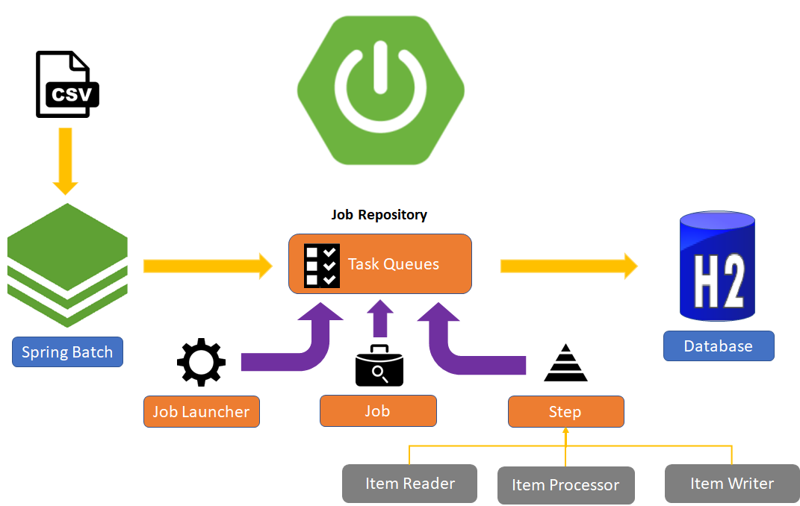
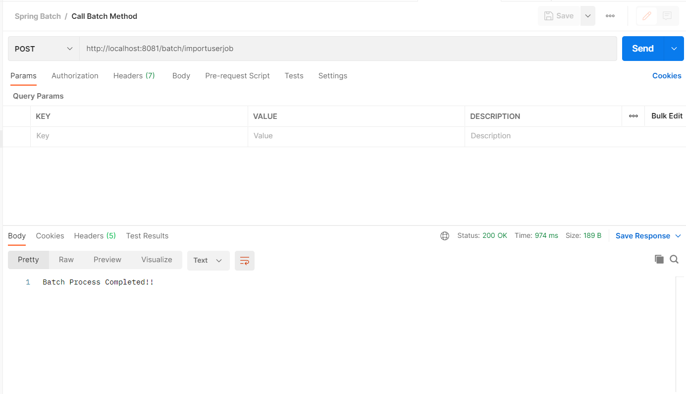
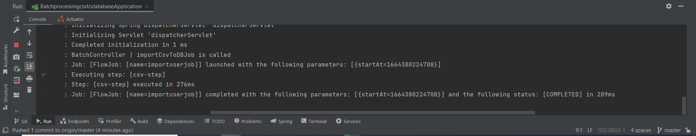
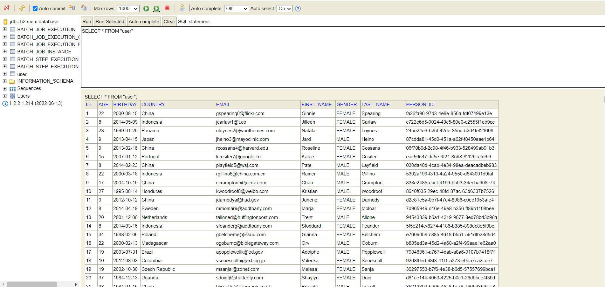
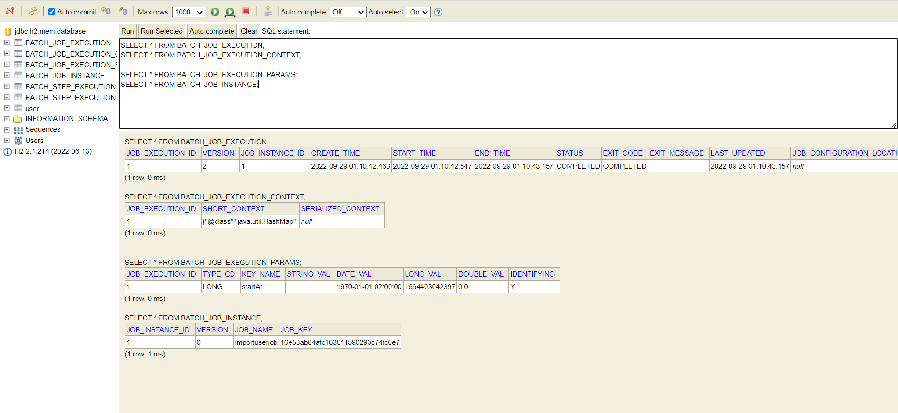
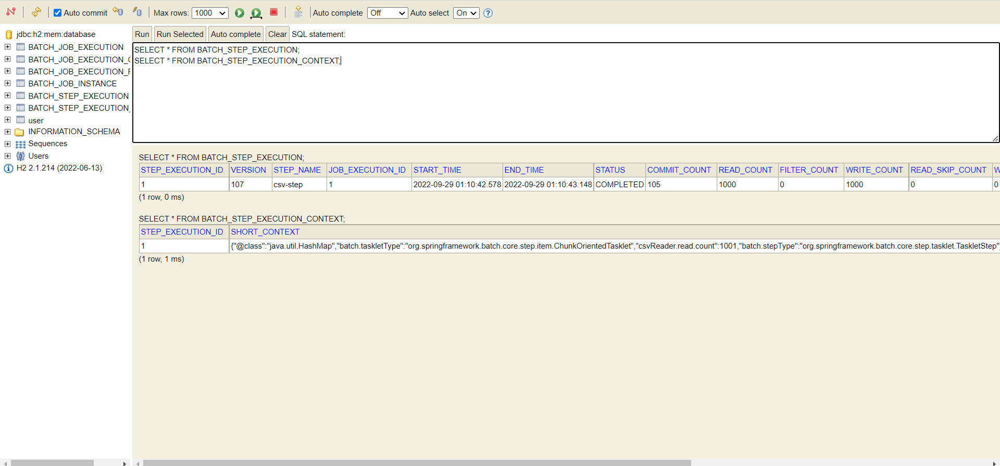

# Spring Boot Batch Processing CSV to DB



### 📖 Information

<ul style="list-style-type:disc">
  <li><b>Spring Batch</b> is a comprehensive batch framework which allows to <b>batch processing</b> for enterprise systems</li>
  <li>These batch processing includes tasks like  reading and writing to files,
transforming data, reading and writing to databases and so on.</li>
  <li>Here is the explanation of the project
      <ul>
        <li>Implement the process of <b>batch</b> covering reading all values from csv file and write all them into database</li>
      </ul>
  </li>
</ul>

### Used Dependencies
* Core
    * Spring
        * Spring Boot
        * Spring Batch
        * Spring Web
        * Spring Data
            * Spring Data JPA
* Database
    * h2
* Lombok

### 🔨 Run the App

<b>1 )</b> Download your project from this link shown below 
```
    git clone https://github.com/Rapter1990/batchprocessingcsvtodatabase
```

<b>2 )</b> Go to the project's home directory shown below
```
    cd batchprocessingcsvtodatabase
```

<b>3 )</b> Create a jar file though this command shown below
```
    mvn clean install
```

<b>4 )</b> Run the project though this command shown below
```
    mvn spring-boot:run
```


Explore Rest APIs
<table style="width:100%">
  <tr>
    <th>Method</th>
    <th>Url</th>
    <th>Description</th>
    <th>Valid Request Body</th>
    <th>Valid Request Params</th>
    <th>Valid Request Params and Body</th>
    <th>No Request or Params</th>
  </tr>
  <tr>
      <td>GET</td>
      <td>importCsvToDBJob</td>
      <td>Import csv file to db</td>
      <td></td>
      <td></td>
      <td></td>
      <td><a href="README.md#importCsvToDBJob">Info</a></td>
  </tr>
</table>


## No Request or Params

##### <a id="importCsvToDBJob">Import csv file to db
```
    http://localhost:8081/batch/importuserjob
```

### Screenshots

<details>
<summary>Click here to show the screenshots of project</summary>
    <p> Figure 1 </p>
    
    <p> Figure 2 </p>
    
    <p> Figure 3 </p>
    
    <p> Figure 4 </p>
    
    <p> Figure 5 </p>
    
</details>    